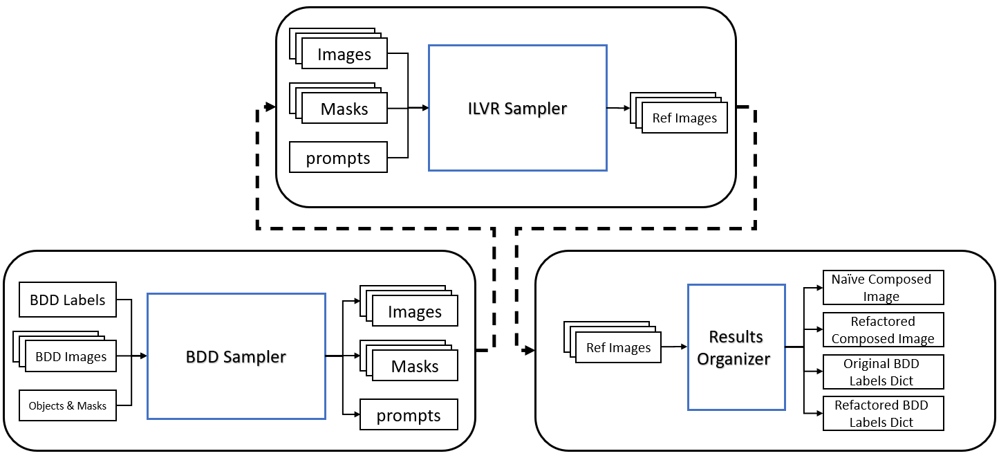
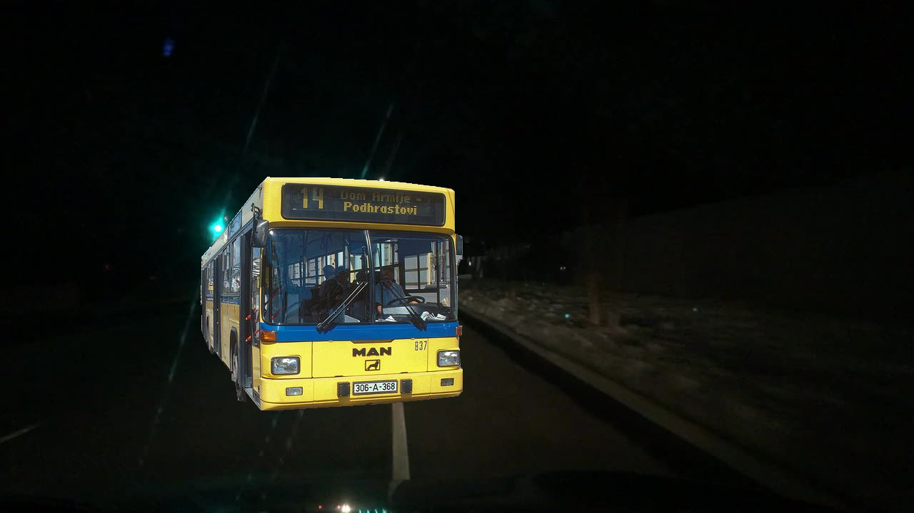
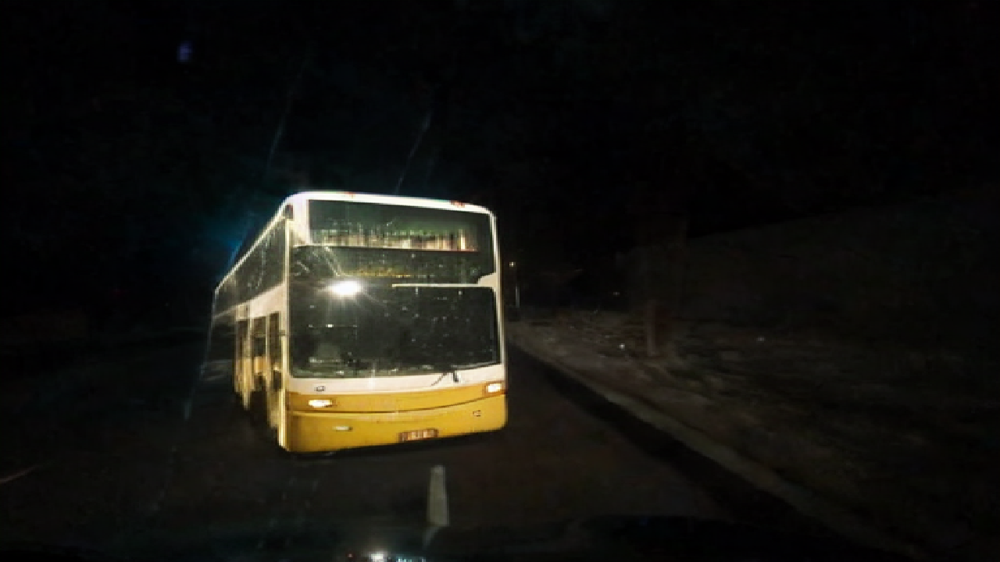
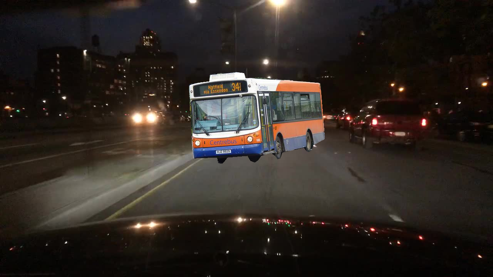
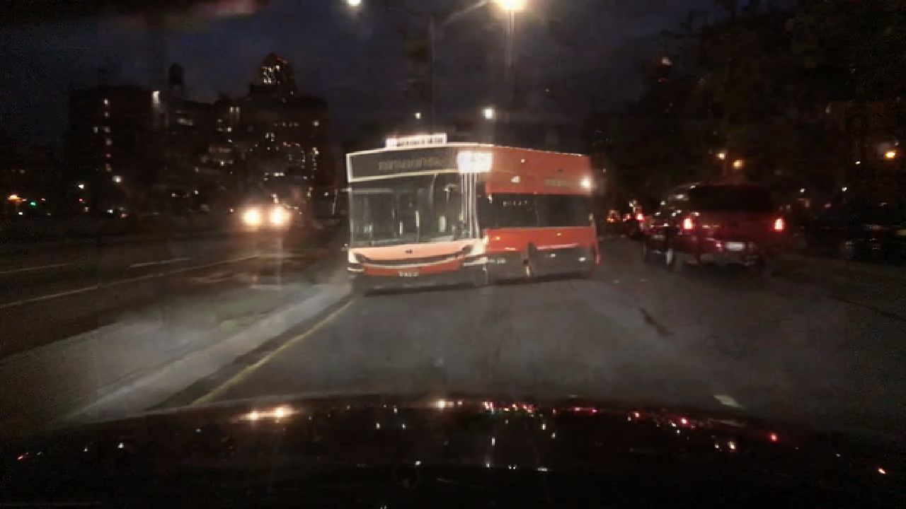
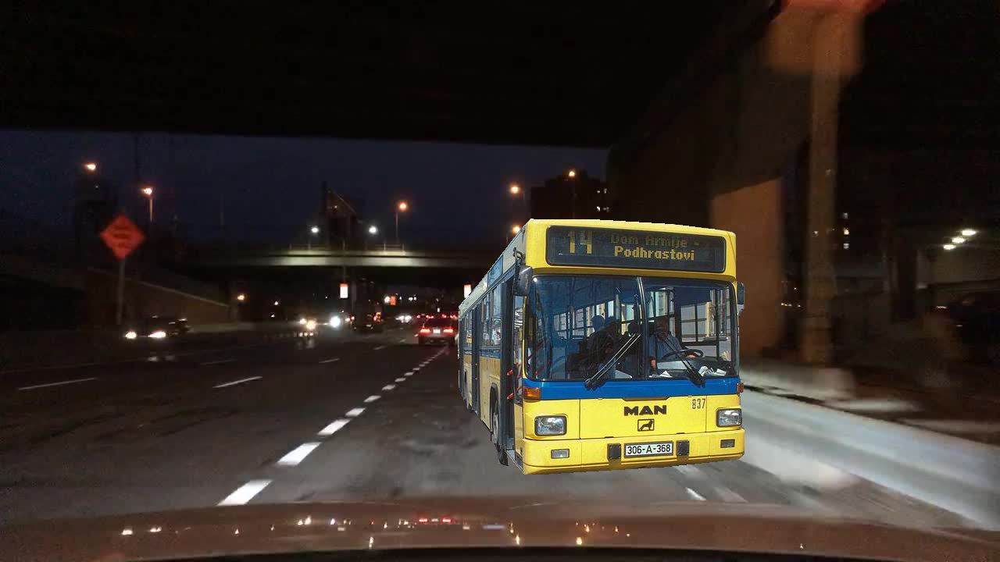
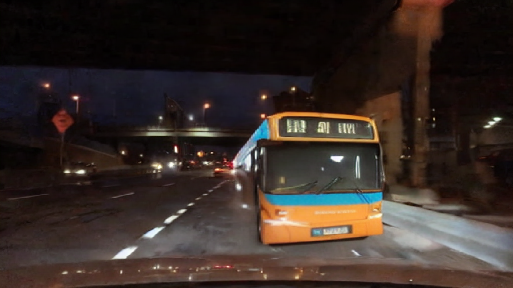

# RGBImageComposition

## Overview
This repository contains an RGBImageComposition pipeline based on Masked-ILVR.
This implementation synthesize object into BDD100k dataset images. 


## Getting Started

1. Clone the repository and configure the environment with the command:
    
    ```
    conda env create -f environment.yaml
    ```

2. Add submodule Resizeright (https://github.com/assafshocher/ResizeRight) and CS2Real (https://github.com/mingrui-zhao/CS2Real)

3. Download the pre-trained diffusion model to /models/ldm/stable-diffusion-v1 from https://huggingface.co/CompVis/stable-diffusion-v-1-4-original
        
    ```
    mkdir -p models/ldm/stable-diffusion-v1/
    ```

4. Download BDD100k dataset:
    - Download BDD100k images and labels from: https://www.bdd100k.com/

5. Create directory with objects to be pasted (objects from the same category). Each object should have 2 images:
    - Image with the relevant object with the suffix - "_obj_{}.jpg"
    - Image with the relevant mask  with the suffix - "_mask_{}.jpg"
    This directory can be semi-automaticlly extract from COCO dataset using the script - "scripts.coco_crop_objects_by_cat_id.py"

6. Fix the relevant paths and parameters by the config directory and run in terminal 
    
    ```
    python main.py
    ```

## Code Architecture
<span align="center"></span>


## Results
Example #1
<span align="left"></span>
<span align="right"></span>

Example #2
<span align="left"></span>
<span align="right"></span>

Example #3
<span align="left"></span>
<span align="right"></span>
